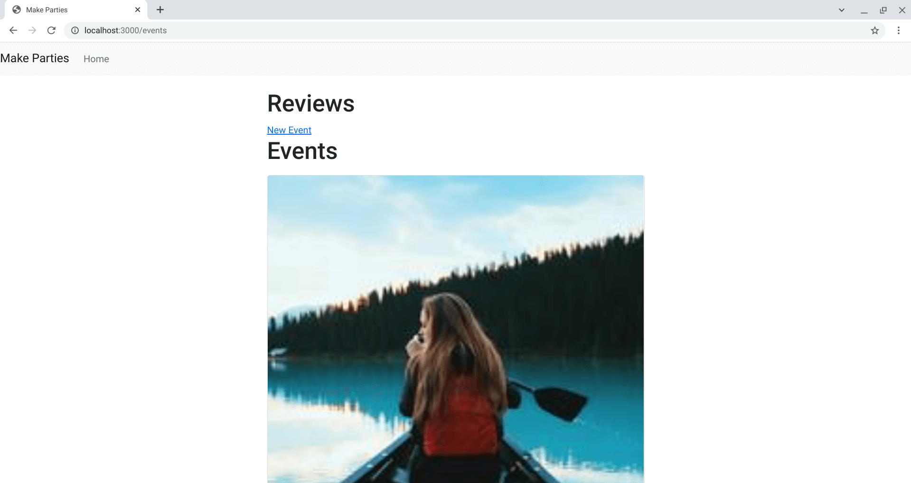
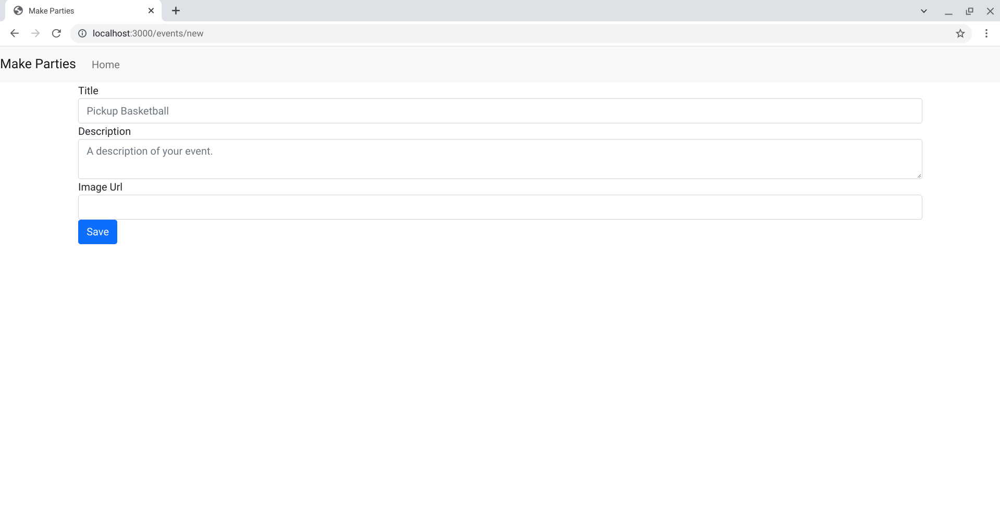
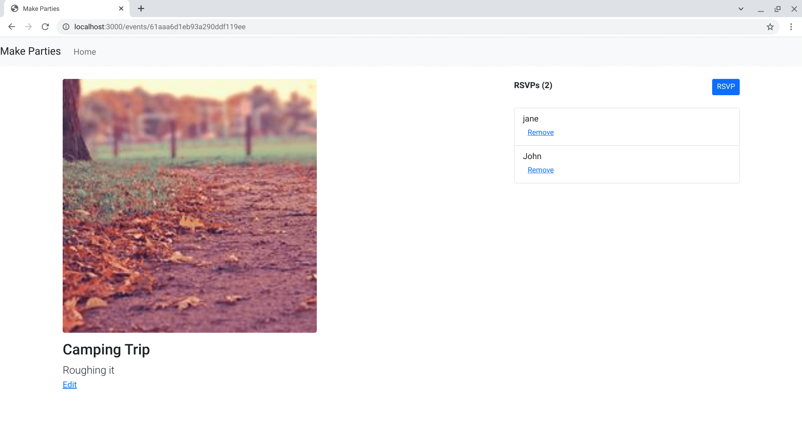
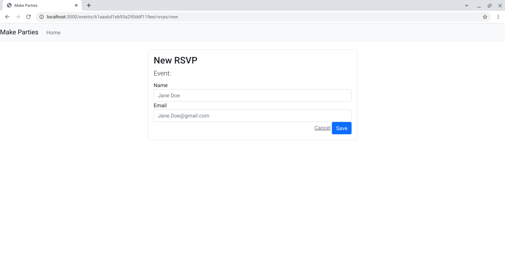

<h1 align="center">Make Parties</h1>

   Based on tutorial from  <a href="https://makeschool.org/mediabook/oa/tutorials/make-tweets/start-an-express-project-z9Y=/" target="_blank">makeschool.org</a>.

## Table of Contents

- [Overview](#overview)
  - [Built With](#built-with)
- [Features](#features)
- [Improvements](#improvements)
- [Useful Resources](#useful-resources)

## Overview

MakeSchool was a coding bootcamp that went under.  Most content was made free and I found this and decided to follow along.

To run, git clone and add a MONGO connection string.

### Built With

- Express
- Mongoose
- Handlebars

## Features

- Replaced SQL for MONGO.
- Avoided using '@handlebars/allow-prototype-access' by using Mongoose and its lean method. 

## Improvements

- Authentication
- File Structure i.e. Controller

### Useful Resources

- [Picsum](https://picsum.photos/)
- [Stack Overflow](https://stackoverflow.com/questions/69959820/typeerror-exphbs-is-not-a-function) - setting up express-handlebars
- [NPM](https://www.npmjs.com/package/express-handlebars) - express-handlebars
- [Github](https://github.com/handlebars-lang/handlebars.js/issues/1648#issuecomment-582241258) - handlebars prototype access
- [Stack Overflow](https://stackoverflow.com/questions/4299991/how-to-sort-in-mongoose) - Mongoose Sort
- [Stack Overflow](https://stackoverflow.com/questions/59690923/handlebars-access-has-been-denied-to-resolve-the-property-from-because-it-is) - lean() *
- [Mastering JS](https://masteringjs.io/tutorials/mongoose/update) - Mongoose Update
- [Stack Overflow](https://stackoverflow.com/questions/25260818/rest-with-express-js-nested-router) - Nested Routes Express
- [Mastering JS](https://masteringjs.io/tutorials/mongoose/objectid) - ObjectID
- [Stack Overflow](https://stackoverflow.com/questions/7034848/mongodb-output-id-instead-of-id) - Mongo ID
- [Stack Overflow](https://stackoverflow.com/questions/18543790/mongoose-objectid-to-number) - Mongoose ObjectId convert
- [Handlebars](https://handlebarsjs.com/examples/builtin-helper-each-block.html) - Handlebars each
- [Stack Overflow](https://stackoverflow.com/questions/10232574/need-handlebars-js-to-render-object-data-instead-of-object-object) - handlebars object object
- [Stack Overflow](https://stackoverflow.com/questions/13645084/access-a-variable-outside-the-scope-of-a-handlebars-js-each-loop) - Access variable outside the scope of a handlebars loop *
